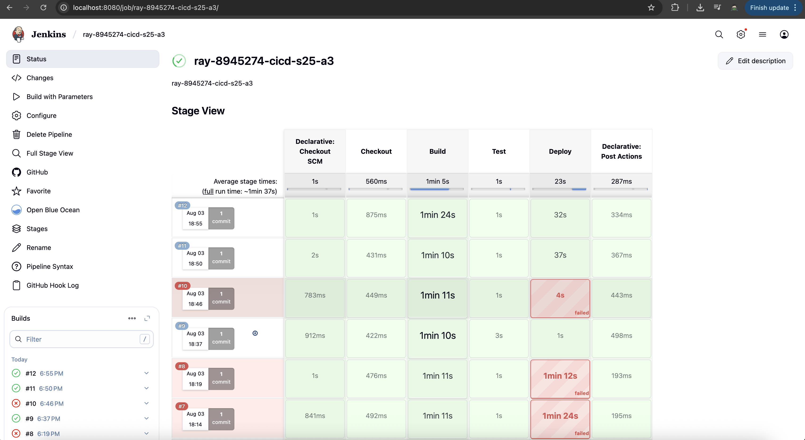
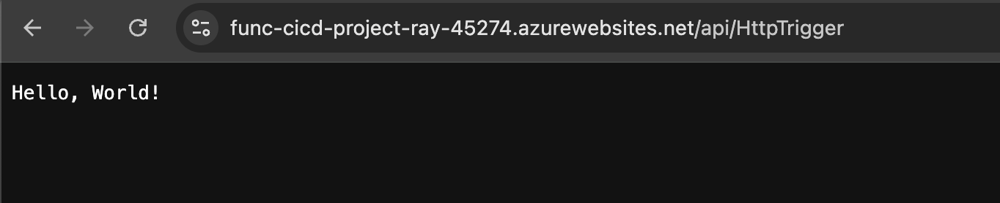

# Azure Functions CI/CD Pipeline

This project demonstrates a complete CI/CD pipeline using Jenkins to deploy Azure Functions.

## **Local Development**

### **Prerequisites**

- Node.js 22 LTS
- Azure Functions Core Tools v4
- Azure CLI
- Jenkins (local installation)

### **Installation**

```bash
# Install dependencies
npm install

# Run tests
npm test

# Start local development server
npm start
```

### **Testing the Function**

```bash
# Test locally
curl http://localhost:7071/api/HttpTrigger
# Expected output: "Hello, World!"
```

## 🔄 **CI/CD Pipeline**

### **Pipeline Stages**

1. **Checkout**: Pulls code from GitHub
2. **Build**: Installs dependencies (`npm install`)
3. **Test**: Runs Jest tests (3 test cases)
4. **Deploy**: Deploys to Azure Functions with `--javascript` flag

### **Jenkins Configuration**

- **Repository**: GitHub with SCM polling (every 5 minutes)
- **Credentials**: GitHub PAT for authentication
- **Deployment**: Azure Functions using `func azure functionapp publish --javascript`
- **Environment**: Local Jenkins with Azure CLI integration

## **Deployment**


### **Manual Deployment**

```bash
# Deploy to Azure Functions
func azure functionapp publish func-cicd-project-ray-45274 --javascript --force
```

### **Automated Deployment**

The Jenkins pipeline automatically deploys when code is pushed to the main branch or when SCM polling detects changes (every 5 minutes).

## **Troubleshooting & Issues Resolved**

### **Issues Encountered and Solutions**

#### **1. Node.js Path Issues**

**Problem**: `npm: command not found` in Jenkins environment
**Solution**: Added Node.js path to Jenkins environment variables

```groovy
PATH = "${env.PATH}:/Users/raychen/.nvm/versions/node/v22.14.0/bin:/opt/homebrew/bin"
```

#### **2. Azure CLI Authentication**

**Problem**: `func: command not found` and Azure CLI not available
**Solution**:

- Added Azure CLI path to Jenkins environment
- Implemented interactive Azure CLI login detection
- Added fallback to deployment package creation

#### **3. GitHub Webhook Issues**

**Problem**: GitHub cannot reach `localhost` URLs for webhooks
**Solution**: Switched to SCM polling with schedule `H/5 * * * *` (every 5 minutes)

#### **4. Student Account Limitations**

**Problem**: Cannot create Azure service principals with student account
**Solution**: Used interactive Azure CLI login instead of service principal authentication

## 📸 **Screenshots**

### **Pipeline Execution**




### **Azure Function Deployment**

The function is successfully deployed and returns "Hello, World!" when accessed.

## 🎯 **Function URL**



**Live Function**: https://func-cicd-project-ray-45274.azurewebsites.net/api/httptrigger

**Test Command**:

```bash
curl https://func-cicd-project-ray-45274.azurewebsites.net/api/httptrigger
# Expected output: "Hello, World!"
```
